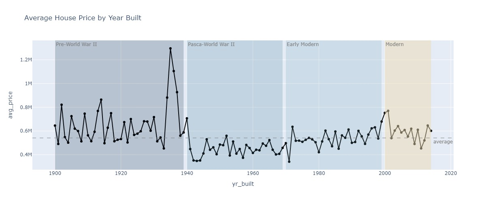
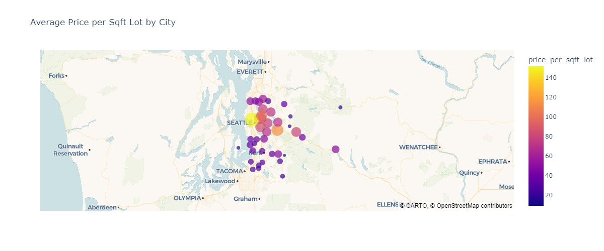
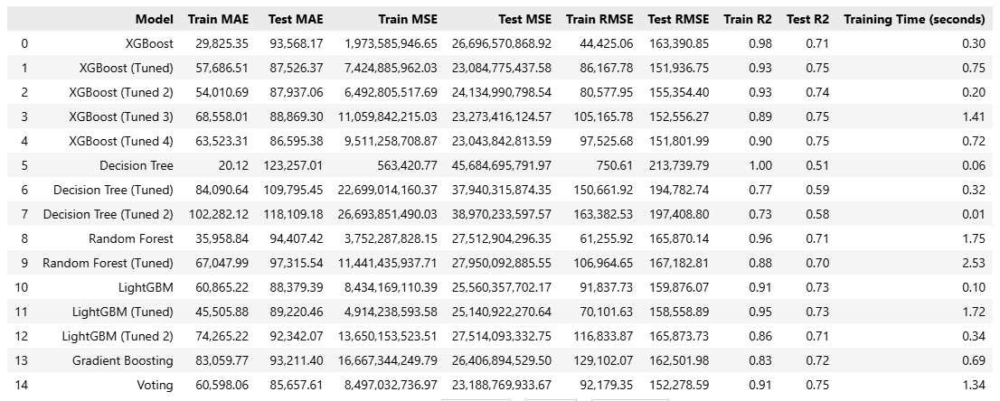

# Fresh Graduate in Data Science

#### Technical Skills: Python, SQL, Excel, Streamlit, Machine Learning

## Education 			        		
- Bachelor of Data Science (S.Si.D) | Universitas Teknologi Yogyakarta (_Aug 2025_)

## Work Experience
**Data Analyst Intern @ Deepublish (_Jan 2024 - May 2024_)**
- Cleaned and processed data, including handling missing values, removing duplicates, and standardizing data formats to improve overall data quality.
- Performed customer segmentation analysis using RFM Analysis and K-Means Clustering to support more targeted marketing strategies.
- Created interactive data visualizations using Matplotlib and Seaborn to present analytical findings to the business team.

**Asistent Lecturer @ Universitas Teknologi Yogyakarta (_Sep 2023 - Dec 2023_)**
- Assisted 30+ students in understanding the fundamentals of data analysis, statistics, and data exploration using Python and SQL.
- Developed 3+ real-world case studies to enhance student engagement and deepen their comprehension of analytical techniques.
- Facilitated hands-on lab sessions and taught tools such as Pandas, NumPy, Matplotlib, and Scikit-learn, contributing to a 30% improvement in student performance based on exam results.

## Projects
### Sentiment Analysis of Café Reviews Using Machine Learning and Streamlit Deployment

This project focuses on analyzing customer reviews of cafés using supervised machine learning algorithms. I built a sentiment classification model using three different algorithms **Logistic Regression**, **Support Vector Machine (SVM)**, and **Naïve Bayes** to classify reviews into positive and negative sentiments. Additionally, I developed a rule-based text categorization method to group sentiments into key aspects such as service, menu, price, and facilities. The final solution was deployed as an interactive web application using **Streamlit**, allowing users to input text or document and view visualization and categorized sentiment. This project highlights my skills in **NLP**, **model evaluation**, and **real-time app deployment**.

### House Price Prediction Using Supervised Machine Learning

In this project, I developed a predictive model to estimate house prices based on various property features such as square footage, number of bedrooms and bathrooms, location, and more. The workflow included data preprocessing, handling missing values, feature engineering, and model evaluation. I implemented multiple supervised learning algorithms such as **Linear Regression**, **Random Forest**, **XGBoost** etc. and compared their performance using **R² score**, **MAE**, **MSE**, and **RMSE** as evaluation metrics. This project demonstrates my skills in **regression modeling**, **exploratory data analysis**, and **data pipeline building**.

##### My Fav EDA ([see more ...](https://github.com/leonalhidayah/house-price-prediction/blob/main/notebooks/01-eda.ipynb))

##### Model Evaluation ([see more ...](https://github.com/leonalhidayah/house-price-prediction/blob/main/notebooks/03-model_dev.ipynb))

<!-- ## Blog
- [Data Science Blog](https://medium.com/@shawhin) -->